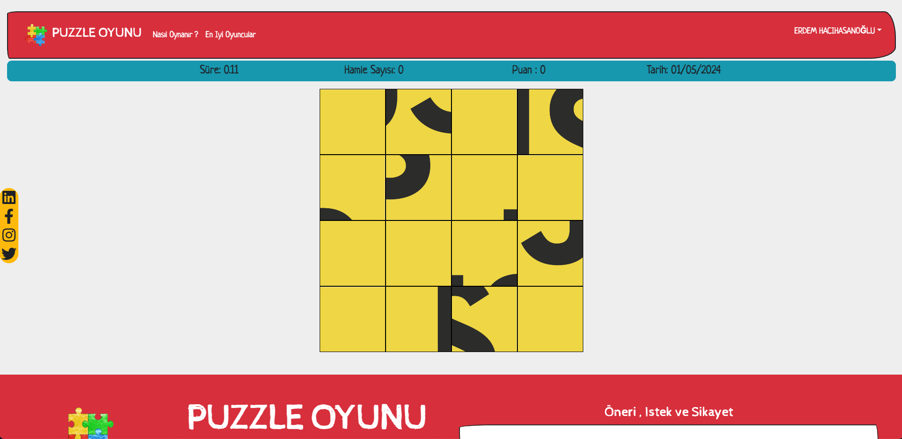

#Puzzle Project

## ÇALIŞMA AMACI
Proje kapsamında tasarlanan puzzle çözme oyunu ile kullanıcıdan dosya ya da Url'den alınan bir resim/fotoğraf dosyasının ekrana 16 parça şeklinde ayrılması beklenmektedir. Yüklenen görsel 4 satır ve 4 sütun olmak üzere 16 parçaya ayrılır. Karıştır butonu ile on altı parçaya ayrılan görsel en az bir parça doğru yerleşene kadar devam eder. Parçaların yer değiştirme şekli değiştirilmek istenen iki butona tıklanma ile gerçekleştirilmektedir.

Aşağıdaki link üzerinden proje içeriğine ait oluşturulmuş gerekli bilgilendirme metnine ve projenin genel tasarım kalıplarına ulaşabilirsiniz.

Proje bilgilendirme dökümanına ulaşmak için [tıklayınız](https://drive.google.com/file/d/1SZu2sO4HuV3GvYNFdnAIBf3imCe7Skha/view?usp=sharing)

## OBJECTIVE
Within the scope of the project, it is expected to design a puzzle-solving game where a user uploads an image/photo file from either a file or URL, and the image is divided into 16 pieces on the screen. The uploaded image is divided into 16 pieces, forming a grid of 4 rows and 4 columns. With the shuffle button, the image divided into sixteen pieces continues until at least one piece is correctly placed. The rearrangement of the pieces is achieved by clicking on two desired buttons.

You can access the necessary informative text about the project content and the general design patterns of the project via the link below.

To access the project information document, [click here](https://drive.google.com/file/d/1SZu2sO4HuV3GvYNFdnAIBf3imCe7Skha/view?usp=sharing)

### ÇALIŞTIRMA AŞAMALARI
 
 Bir terminal açılıp aşağıdaki aşamalar sırasıyla gerçekleştirilmelidir;
- ````
  cd client 
  ````
  
- ````
  npm i
  ````
 
- ````
  npm start
  ````
 
 Ardından farklı bir terminal açılıp aşağıdaki aşamalar sırasıyla gerçekleştirilmelidir;
- ````
  cd server
  ````
  
- ````
  npm i
  ````
  
- ````
  npm start
  ````
 

